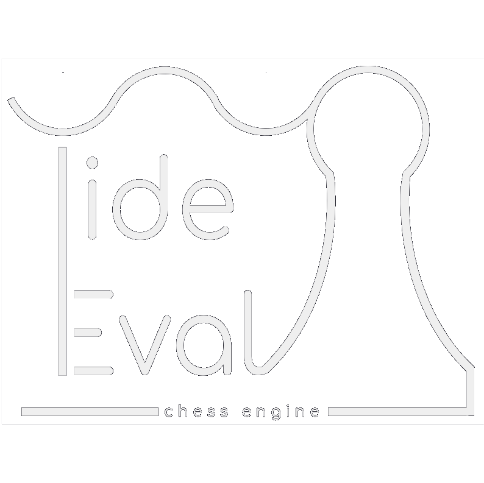

# Tide Eval #

  <a href="#"></img></a>
  <a href="https://opensource.org/license/gpl-3-0"></img></a>
  <a href="#"></img></a>
  <a href="#"></img></a>
  <a href="#"></img></a>
  <a href="https://github.com/chrinspire/TideEval/graphs/contributors"></img></a>
  <a href="https://github.com/chrinspire/TideEval/issues"></img></a>

**Weird New Chess Algorithm**  
- no recursive min-max/alpha-beta tree search through future moves+chessboards at all,  
- move decisions are solely based on data explored and deducted on the current board  
- evaluating back and forth like the Tide, so to speak  

This is only the very beginning of an interesting project - the code might not yet be useful for anyone else and might never be :-P

The class **ChessBasics** might be useful for experimental chess developments in Java.  
You can use it independently of hte rest of the code.

**UI**  
Thanks to [Timon Ensel](https://github.com/forgottosave) it comes with a UI to try it out and **play** against the algorithm  
  -> type `move` or `automove` in command field.

It also serves to explore the data used to derive the moves.  
  -> select chess pieces or squares and / or click on data fields on the right for colorful highlights
