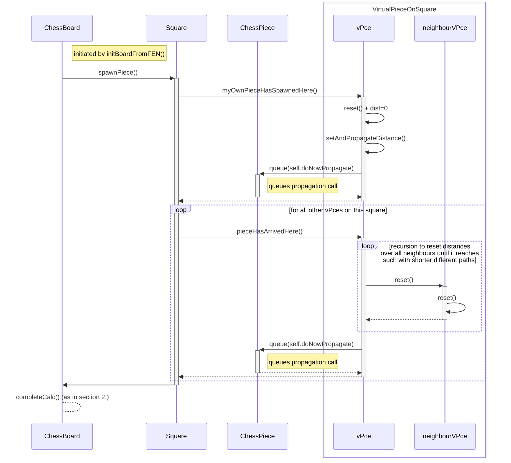
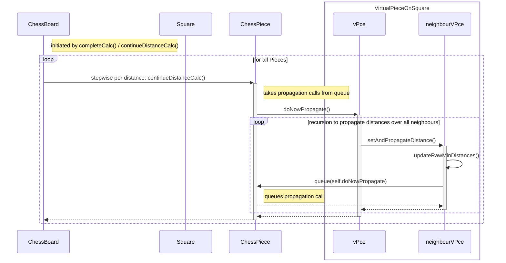
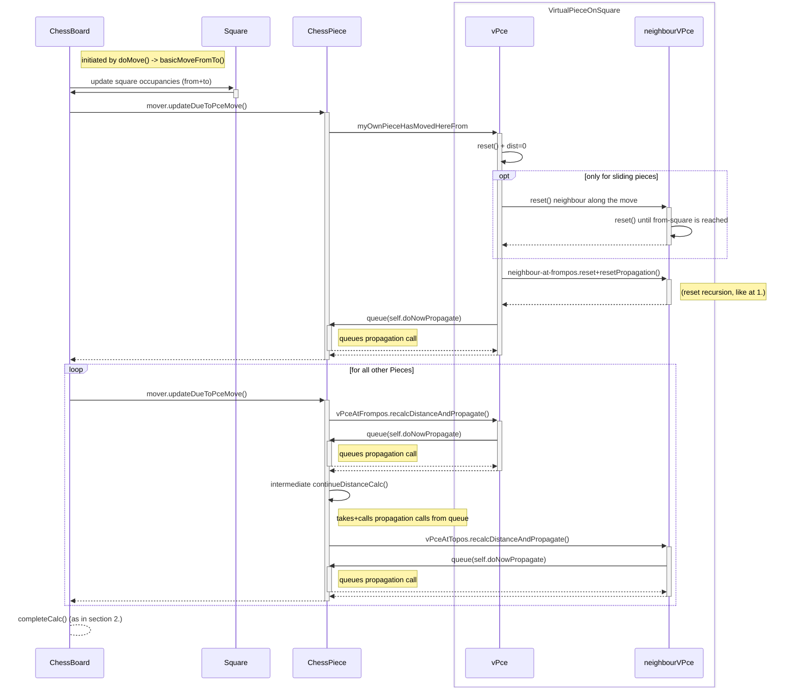
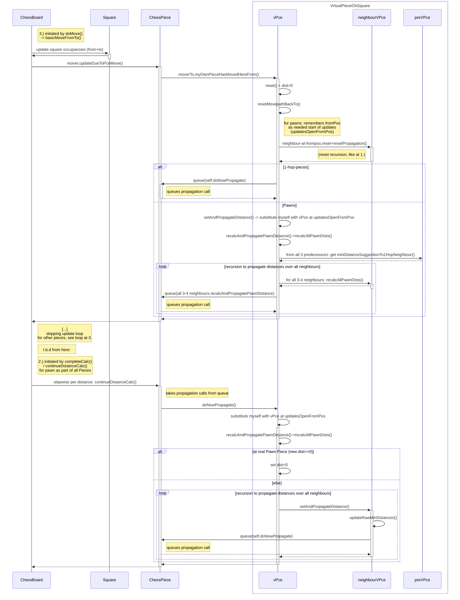

# Sequence diagrams for updating Piece distances

The main idea in this implementation is to avoid realculating al pieces movements and distances every time e.g. a move occurs, but to find and update only the parts that need to be changed.

## 1. Spawning a new piece
May be this look like hell :-) but the basic points are rather simple:
- A Square that gets a new Piece tells the new Piece - actually no the pieces, but its "virtual representatives" (vPces) on this square - that it has a distance of 0 and initiates the propagation to neighbours (so finally all distances will be calculated)
- It also tells all other vPces here that something changed here, so they can initiate the recalculation of their distances.
- The distance updates need two steps:
  1. immediately recursively reset (clear) the distances that are invalid (along the USW = unique shortest way)
  2. initiate the propagation of the new values to neighbours

Note that the actual calculation / propagation of new distance values has not been carried out yet. This is triggered later (e.g. after all pieces are spawned.

## 2. Performing breadth first distance calculation

As shown above, calculation and propagation of distances was not done recursively in the diagram above, as this would lead to a depth first implementation (including running in circles and later knowing there were shorter paths).

The changes of spawning or moving a piece only leads to the initiating of update processes, by queueing calls to the neighbours. The Piece stored these calls and lets those be executed later on demand of the ChessBoard. This leads to a breadth search.

# 3. Distance updates when a Piece moves

This is similar to spawning, but there is no new piece that needs a new/fresh calculation.

This is followed by the breadth calculation and propagation as described above.

# 4. Distance updates in more detail for moving pawns

This is similar to spawning, but there is no new piece that needs a new/fresh calculation.

